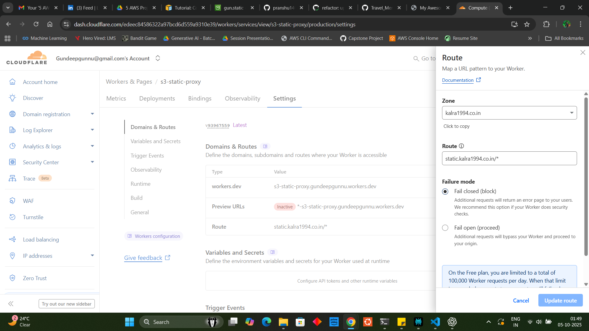

# Static Website Hosting with AWS S3 and Cloudflare

A complete guide to deploying a static website using AWS S3, GitHub Actions for CI/CD, and Cloudflare for custom domain with HTTPS.

## 🚀 Overview

This project demonstrates a professional static website hosting solution that combines:
- **AWS S3** for reliable storage and hosting
- **GitHub Actions** for automated deployment
- **Cloudflare** for global CDN, SSL, and custom domain
- **Cloudflare Workers** for seamless domain experience

## 📋 Table of Contents

- [Prerequisites](#prerequisites)
- [AWS S3 Setup](#aws-s3-setup)
- [GitHub Actions Configuration](#github-actions-configuration)
- [Cloudflare Integration](#cloudflare-integration)
- [Cloudflare Worker Implementation](#cloudflare-worker-implementation)
- [Final Results](#final-results)
- [Architecture](#architecture)
- [Benefits](#benefits)

## 🔧 Prerequisites

- AWS Account with S3 access
- GitHub Account
- Custom domain (e.g., `kalra1994.co.in`)
- Cloudflare Account (free tier works)

---

## 🗂️ AWS S3 Setup

### Step 1: Create Repository
Create a new GitHub repository with your HTML files for static website hosting.


### Step 2: Create S3 Bucket
Create an S3 bucket with a unique name for hosting your static website.


### Step 3: Enable Static Website Hosting
Configure your S3 bucket to serve static websites by enabling static website hosting.


### Step 4: Configure Public Access
Edit Block Public Access settings to allow public access to your website files.


### Step 5: Add Bucket Policy
Add a bucket policy that makes the bucket content publicly accessible for website visitors.


```json
{
    "Version": "2012-10-17",
    "Statement": [
        {
            "Sid": "PublicReadGetObject",
            "Effect": "Allow",
            "Principal": "*",
            "Action": "s3:GetObject",
            "Resource": "arn:aws:s3:::gun.static/*"
        }
    ]
}
```

---

## ⚙️ GitHub Actions Configuration

### Step 6: Setup GitHub Secrets
Configure GitHub repository secrets for AWS credentials and deployment automation.


Required secrets:
- `AWS_ACCESS_KEY_ID`
- `AWS_SECRET_ACCESS_KEY`
- `AWS_REGION`
- `S3_BUCKET_NAME`

### Step 7: Create Workflow
Set up GitHub Actions workflow for automated deployment to S3 on every push.


### Step 8: Automated Deployment
GitHub Actions automatically triggers on push and uploads files to your S3 bucket.


### Step 9: S3 Website Live
Your website is now running on the S3 bucket website endpoint.


**S3 Website URL**: `http://gun.static.s3-website-us-west-2.amazonaws.com`

---

## 🌐 Cloudflare Integration

### DNS and SSL Configuration

Add your domain to Cloudflare and configure the following settings:

- **Domain**: `kalra1994.co.in`
- **Nameservers**: Update at your domain registrar
- **SSL/TLS Settings**:
  - Encryption mode: **Flexible** (HTTPS to Cloudflare, HTTP to S3)
  - Always Use HTTPS: **Enabled**

### Step 10: DNS CNAME Record
Create a CNAME record pointing your subdomain to the S3 website endpoint.


```
Type: CNAME
Name: static
Target: gun.static.s3-website-us-west-2.amazonaws.com
Proxy: Enabled (Orange Cloud)
```

---

## 🔧 Cloudflare Worker Implementation

### The Challenge
Direct CNAME mapping causes a "Host header" issue where S3 receives `static.kalra1994.co.in` instead of the expected `gun.static.s3-website-us-west-2.amazonaws.com`, resulting in "NoSuchBucket" errors.

### The Solution: Cloudflare Worker

### Step 11: Worker Route Configuration
Configure the Cloudflare Worker route to intercept requests to your custom domain.



**Route**: `static.kalra1994.co.in/*`

### Worker Code
```javascript
export default {
  async fetch(request, env, ctx) {
    try {
      // Get the original URL
      const url = new URL(request.url);
      
      // Replace hostname and protocol for S3
      url.hostname = 'gun.static.s3-website-us-west-2.amazonaws.com';
      url.protocol = 'http:';
      
      // Create new headers without problematic ones
      const newHeaders = new Headers();
      for (const [key, value] of request.headers.entries()) {
        // Skip host header and other problematic headers
        if (key.toLowerCase() !== 'host' && 
            key.toLowerCase() !== 'cf-ray' && 
            key.toLowerCase() !== 'cf-connecting-ip') {
          newHeaders.set(key, value);
        }
      }
      
      // Set the correct host header for S3
      newHeaders.set('host', 'gun.static.s3-website-us-west-2.amazonaws.com');
      
      // Fetch from S3
      const response = await fetch(url.toString(), {
        method: request.method,
        headers: newHeaders,
        body: request.method !== 'GET' && request.method !== 'HEAD' ? request.body : null,
      });
      
      // Create new response
      const newResponse = new Response(response.body, {
        status: response.status,
        statusText: response.statusText,
        headers: response.headers
      });
      
      return newResponse;
      
    } catch (error) {
      return new Response('Worker Error: ' + error.message, { status: 500 });
    }
  },
};
```

### How It Works
1. **Intercepts** requests to `static.kalra1994.co.in`
2. **Modifies** the Host header to match S3 expectations
3. **Proxies** the request to S3 using HTTP
4. **Returns** content to the user with HTTPS on the custom domain

---

## 🎯 Final Results

### Step 12: Working Custom Domain
Your website is now accessible via your custom domain with HTTPS, maintaining the professional URL throughout the user experience.


### Live URLs
- **🔗 Custom Domain (HTTPS)**: https://static.kalra1994.co.in ✅
- **🔗 S3 Direct**: http://gun.static.s3-website-us-west-2.amazonaws.com

---

## 🏗️ Architecture


**Flow**: `GitHub → GitHub Actions → S3 Bucket → Cloudflare Worker → Users`

---

## ✨ Key Benefits

| Feature | Description |
|---------|-------------|
| 🏷️ **Custom Domain** | Professional branding with your own domain |
| 🔒 **HTTPS Security** | SSL certificate via Cloudflare |
| 🌍 **Global CDN** | Fast worldwide access via Cloudflare edge servers |
| 🚀 **Auto Deployment** | Push to GitHub = Live website updates |
| 💰 **Cost Effective** | ~$1/month total cost |
| 🔄 **No Redirects** | Visitors stay on your custom domain |
| ⚡ **High Performance** | Optimized delivery through CDN |
| 📈 **Scalable** | Handles traffic spikes automatically |

---

## 💰 Cost Breakdown

- **GitHub**: Free
- **AWS S3**: ~$0.50/month (for small static sites)
- **Cloudflare**: Free tier (includes SSL, CDN, Workers)
- **Domain**: Annual registration fee only

**Total Monthly Cost**: < $1 🎉

---

## 🔧 Maintenance

- **Content Updates**: Simply push to GitHub repository
- **SSL Renewal**: Automatic via Cloudflare
- **Monitoring**: Available through Cloudflare Analytics
- **Backups**: Git repository serves as version control

---

## 📚 Additional Resources

- [AWS S3 Static Website Hosting Guide](https://docs.aws.amazon.com/AmazonS3/latest/userguide/WebsiteHosting.html)
- [GitHub Actions Documentation](https://docs.github.com/en/actions)
- [Cloudflare Workers Documentation](https://developers.cloudflare.com/workers/)

---

*This project demonstrates enterprise-grade static website hosting using modern DevOps practices and cloud technologies.*
